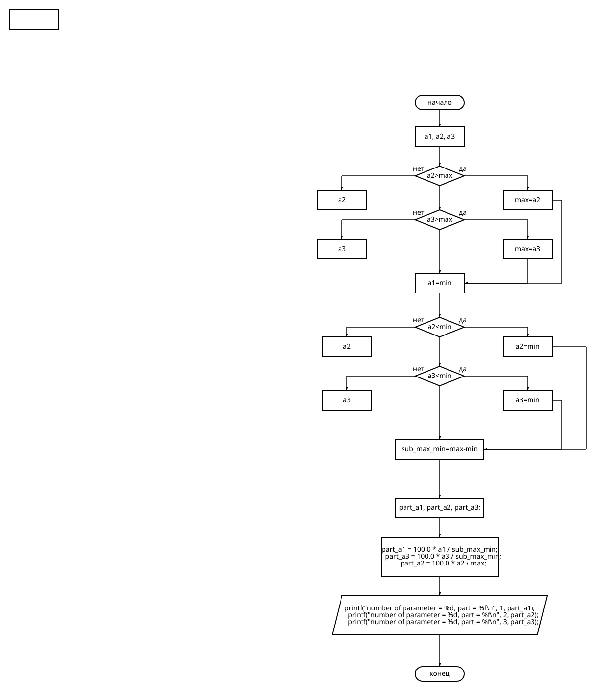

# Лабораторная работа №1
## Вариант 4
## Задания
1. Составить блок-схему алгоритма(вывести номер и долю в процентах наибольшего из параметров a1, a2, a3 в случае его чётности, и номера и разность значений наибольшего и наименьшего из параметров иначе);
2. Написать программу, решающую данную задачу;
3. Составить отсчет в README.md(это он и есть).
## Cхема
README.md 
## Программа
```c
#include <stdio.h>
 
 int main()
{
    float a1, a2, a3;
    printf("int a1 -> ");
    scanf("%f", &a1);
    printf("int a2 -> ");
    scanf("%f", &a2);
    printf("int a3 -> ");
    scanf("%f", &a3);
    float max, min, sub_max_min;
    max = a1;
    if (a2 > max)
        max = a2;
    if (a3 > max)
        max = a3;
    min = a1;
    if (a2 < min)
        min = a2;
    if (a3 < min)
        min = a3;
    sub_max_min = max - min;
    float part_a1, part_a2, part_a3;
    part_a1 = 100.0 * a1 / sub_max_min;
    part_a3 = 100.0 * a3 / sub_max_min;
    part_a2 = 100.0 * a2 / max;
    printf("number of parameter = %d, part = %f\n", 1, part_a1);
    printf("number of parameter = %d, part = %f\n", 2, part_a2);
    printf("number of parameter = %d, part = %f\n", 3, part_a3);
    return 0;
}
```
Программа находится в файле: lab1.c


