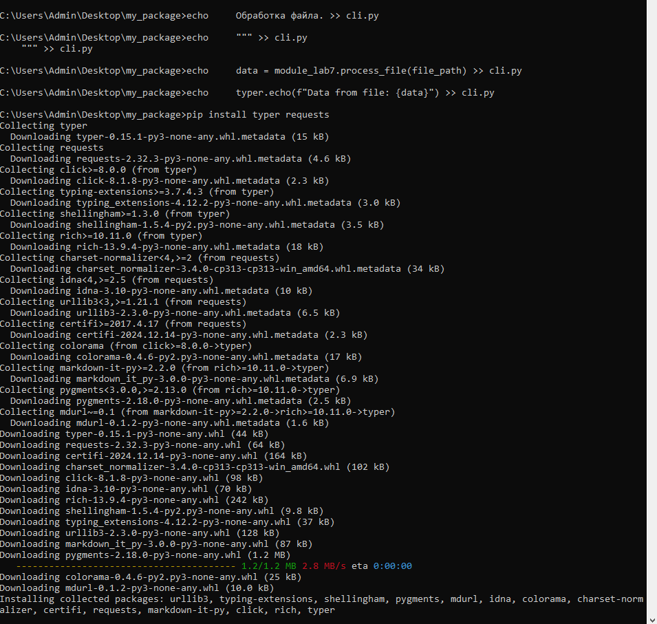

# Лабораторная работа №10
## Задания
1. Создайте пакет, содержащий 3 модуля на основе лабораторных работ №№ 7-9
2. Напишите запускающий модуль на основе Typer, который позволит выбирать и настраивать параметры запуска логики из пакета.
3. Оформите отчёт в README.md. Отчёт должен содержать:
- Условия задач
- Описание проделанной работы
- Скриншоты результатов
## Ход работы
На основе лекций по информатике я смог выполнить данную задачу через командную строку( создал базовую структуру пакета, которую можно заполнить модулями из моих лабораторных работ 7-9)
1. Первым делом переходим в cmd и создаем директорию нашего пакета, также добавив файл _init_.py в пакет my_package. Далее создаем три модуля для лабораторных работ

2. Создаем запускающий модуль cli.py 

3. Теперь структура выглядит следующим образом

4. Теперь используем команду echo для записи текста в файл. Файл module_lab7.py

5. Файл module_lab8.py

6. Файл module_lab9.py

7. Файл cli.py

8. Теперь стоит убедиться, установлены ли все пакеты

После написания данной команды, вывод будет следующим:

Таким образом, я создал базовую структуру пакета, которую можно заплнить модулями из лабораторных работ 7-9

