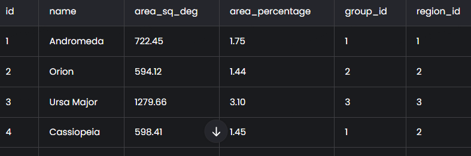
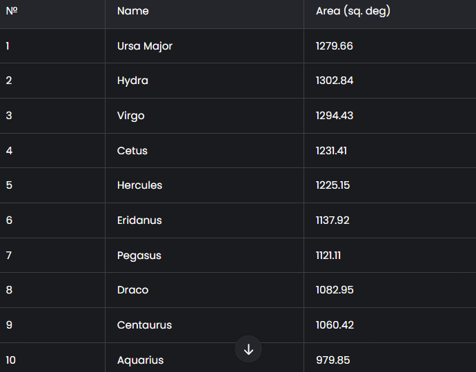
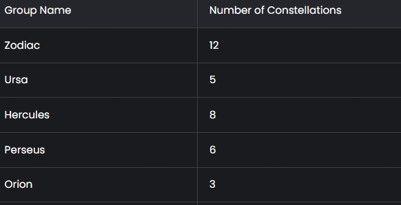
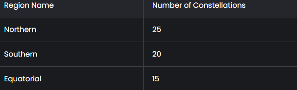

# Лабораторная работа №15
1. Спроектируйте БД с использованием crow’s foot notation.
2. Реализуйте парсер для сбора данных с веб-страницы.
3. С помощью DB API cоздайте таблицы БД и заполните их данными, полученными с помощью парсера.
4. Напишите запросы для выборки данных из БД.
5. Оформите отчёт в README.md. Отчёт должен содержать:
- Условия задач
- Описание проделанной работы
- Скриншоты результатов
- Ссылки на используемые материалы
## Реализация парсера для сбора данных с веб-страницы
## Описание проделанной работы

### Проектирование базы данных

База данных была спроектирована с использованием **crow’s foot notation**. Структура базы данных включает три основные таблицы:

#### Таблица `constellation`

| Поле            | Тип        | Описание                      |
|-----------------|------------|-------------------------------|
| `id`            | INT        | PRIMARY KEY, AUTO_INCREMENT   |
| `name`          | VARCHAR    | Название созвездия            |
| `area_sq_deg`   | FLOAT      | Площадь в квадратных градусах |
| `area_percentage`| FLOAT     | Площадь в процентах           |
| `group_id`      | INT        | FOREIGN KEY к таблице `group` |
| `region_id`     | INT        | FOREIGN KEY к таблице `region`|

#### Таблица `group`

| Поле        | Тип     | Описание                      |
|-------------|---------|-------------------------------|
| `id`        | INT     | PRIMARY KEY, AUTO_INCREMENT   |
| `group_name`| VARCHAR | Название группы               |

#### Таблица `region`

| Поле         | Тип     | Описание                      |
|--------------|---------|-------------------------------|
| `id`         | INT     | PRIMARY KEY, AUTO_INCREMENT   |
| `region_name`| VARCHAR | Название области              |

### Разработка парсера

Для сбора данных о созвездиях был разработан парсер с использованием библиотеки `BeautifulSoup`. Парсер извлекает следующие данные:

- Название созвездия
- Площадь в квадратных градусах
- Процент площади от общей площади неба
- Группа
- Область

```python
import requests
from bs4 import BeautifulSoup

def parse_constellations(url):
    response = requests.get(url)
    soup = BeautifulSoup(response.content, 'html.parser')
    
    constellations = []
    table = soup.find('table', {'class': 'wikitable'})
    rows = table.find_all('tr')
    
    for row in rows[1:]:  # Пропускаем заголовок
        cols = row.find_all('td')
        name = cols[0].text.strip()
        area_sq_deg = float(cols[1].text.strip())
        area_percentage = float(cols[2].text.strip())
        group = cols[3].text.strip()
        region = cols[4].text.strip()
        
        constellations.append({
            'name': name,
            'area_sq_deg': area_sq_deg,
            'area_percentage': area_percentage,
            'group': group,
            'region': region
        })
    
    return constellations
```
## Создание и заполнение базы данных
``` py
import sqlite3

def create_database():
    conn = sqlite3.connect('constellations.db')
    cursor = conn.cursor()
    
    # Создание таблиц
    cursor.execute('''
        CREATE TABLE IF NOT EXISTS group (
            id INTEGER PRIMARY KEY AUTOINCREMENT,
            group_name VARCHAR(100) NOT NULL
        )
    ''')
    
    cursor.execute('''
        CREATE TABLE IF NOT EXISTS region (
            id INTEGER PRIMARY KEY AUTO_INCREMENT,
            region_name VARCHAR(100) NOT NULL
        )
    ''')
    
    cursor.execute('''
        CREATE TABLE IF NOT EXISTS constellation (
            id INTEGER PRIMARY KEY AUTO_INCREMENT,
            name VARCHAR(100) NOT NULL,
            area_sq_deg FLOAT NOT NULL,
            area_percentage FLOAT NOT NULL,
            group_id INT,
            region_id INT,
            FOREIGN KEY (group_id) REFERENCES group(id),
            FOREIGN KEY (region_id) REFERENCES region(id)
        )
    ''')
    
    conn.commit()
    return conn, cursor

def insert_data(conn, cursor, constellations):
    # Вставка данных в таблицы group и region
    groups = set([c['group'] for c in constellations])
    regions = set([c['region'] for c in constellations])
    
    for group in groups:
        cursor.execute('INSERT INTO group (group_name) VALUES (?)', (group,))
    for region in regions:
        cursor.execute('INSERT INTO region (region_name) VALUES (?)', (region,))
    
    conn.commit()
    
    # Получение ID групп и регионов
    group_map = {}
    for group in groups:
        cursor.execute('SELECT id FROM group WHERE group_name = ?', (group,))
        group_map[group] = cursor.fetchone()[0]
    
    region_map = {}
    for region in regions:
        cursor.execute('SELECT id FROM region WHERE region_name = ?', (region,))
        region_map[region] = cursor.fetchone()[0]
    
    # Вставка данных в таблицу constellation
    for constellation in constellations:
        cursor.execute('''
            INSERT INTO constellation (name, area_sq_deg, area_percentage, group_id, region_id)
            VALUES (?, ?, ?, ?, ?)
        ''', (
            constellation['name'],
            constellation['area_sq_deg'],
            constellation['area_percentage'],
            group_map[constellation['group']],
            region_map[constellation['region']]
        ))
    
    conn.commit()
```
## Написание запросов
1. Топ N больших/маленьких по площади в квадратных градусах:
``` py
SELECT name, area_sq_deg
FROM constellation
ORDER BY area_sq_deg {ASC/DESC}
LIMIT N
```
2. Топ N больших/маленьких по площади в процентах:
``` py
SELECT name, area_percentage
FROM constellation
ORDER BY area_percentage {ASC/DESC}
LIMIT N
```
3. Созвездия с группировкой по группам:
``` py
SELECT g.group_name, COUNT(c.id) as count
FROM constellation c
JOIN group g ON c.group_id = g.id
GROUP BY g.group_name
```
4. Созвездия с группировкой по областям:
``` py
SELECT r.region_name, COUNT(c.id) as count
FROM constellation c
JOIN region r ON c.region_id = r.id
GROUP BY r.region_name
```
## Скришноты результатов
1. Таблица cosellation после заполнения

2. Результат запроса топ 10 больших по площади созвездий

3. Результат запроса группировки по группам

4. Результат запроса группировки по областям

