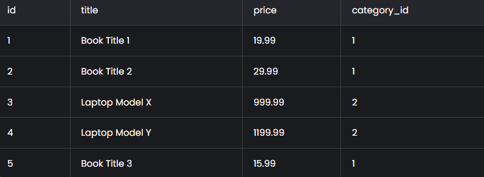
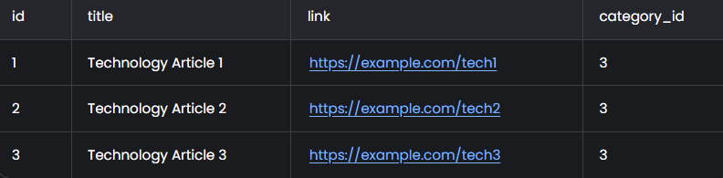

# Лабораторная работа №16
1. Реализуйте парсер с использованием Selenium для сбора данных с веб-страницы. Это может быть:
- онлайн-каталог
- интернет-магазин
- энциклопедия и т.д.
2. Создайте таблицы БД и заполните их данными, полученными с помощью парсера. У вас должно быть минимум 2 таблицы. При заполнении в запросах используйте именованные плейсхолдеры драйвера вашей СУБД.
3. Напишите запросы для выборки данных из БД с использованием PyPika Query Builder. У вас должно быть:
- 2 запроса с JOIN
- 3 запроса с расчётом статистики/группировкой/агрегирующими функциями
4. Оформить отчёт в README.md.
## Описание проделанной работы
### Установка необходимых библиотек:
``` py
pip install selenium
pip install pypika
```
1. **Парсинг данных**:
   - Использование Selenium для парсинга данных с Amazon, Best Buy и Wikipedia.
   - Сбор данных о книгах, ноутбуках и статьях.
### Парсинг данных с Amazon
``` py
from selenium import webdriver
from selenium.webdriver.common.by import By
import sqlite3
from pypika import Query, Table, Column, functions
import time

# Инициализация Selenium
driver = webdriver.Chrome(executable_path='path_to_chromedriver')

# Парсинг данных с Amazon
driver.get('https://www.amazon.com/books')
time.sleep(3)  # Подождать загрузки страницы

books = driver.find_elements(By.CLASS_NAME, 's-result-item')

data_books = []
for book in books:
    try:
        title = book.find_element(By.CSS_SELECTOR, 'h2').text
        price = book.find_element(By.CSS_SELECTOR, '.a-price-whole').text
        data_books.append((title, price))
    except:
        continue

driver.quit()
```
### Парсинг данных с Bestbuy
``` py
# Инициализация Selenium
driver = webdriver.Chrome(executable_path='path_to_chromedriver')

# Парсинг данных с Best Buy
driver.get('https://www.bestbuy.com/site/laptops/pcmcat247400050000.c?id=pcmcat247400050000')
time.sleep(3)  # Подождать загрузки страницы

laptops = driver.find_elements(By.CLASS_NAME, 'sku-item')

data_laptops = []
for laptop in laptops:
    try:
        title = laptop.find_element(By.CSS_SELECTOR, 'h4').text
        price = laptop.find_element(By.CSS_SELECTOR, '.priceView-customer-price').text
        data_laptops.append((title, price))
    except:
        continue

driver.quit()
```
### Парсинг данных с Wikipedia
``` py
# Инициализация Selenium
driver = webdriver.Chrome(executable_path='path_to_chromedriver')

# Парсинг данных с Wikipedia
driver.get('https://www.wikipedia.org/')
time.sleep(3)  # Подождать загрузки страницы

technology_link = driver.find_element(By.LINK_TEXT, 'Technology')
technology_link.click()
time.sleep(3)

articles = driver.find_elements(By.CSS_SELECTOR, '.mw-category-group a')

data_articles = []
for article in articles:
    title = article.text
    link = article.get_attribute('href')
    data_articles.append((title, link))

driver.quit()
```
2. **Создание базы данных**:
   - Создание базы данных `scraped_data.db` с таблицами `products`, `categories` и `articles`.
   - Вставка данных в таблицы с использованием именованных плейсхолдеров.
``` py
# Подключение к базе данных
conn = sqlite3.connect('scraped_data.db')
cursor = conn.cursor()

# Создание таблиц
cursor.execute('''
    CREATE TABLE IF NOT EXISTS categories (
        id INTEGER PRIMARY KEY,
        name TEXT NOT NULL
    )
''')

cursor.execute('''
    CREATE TABLE IF NOT EXISTS products (
        id INTEGER PRIMARY KEY,
        title TEXT NOT NULL,
        price TEXT,
        category_id INTEGER,
        FOREIGN KEY (category_id) REFERENCES categories (id)
    )
''')

cursor.execute('''
    CREATE TABLE IF NOT EXISTS articles (
        id INTEGER PRIMARY KEY,
        title TEXT NOT NULL,
        link TEXT,
        category_id INTEGER,
        FOREIGN KEY (category_id) REFERENCES categories (id)
    )
''')

# Вставка данных в таблицы
# Вставка категорий
cursor.execute('INSERT INTO categories (name) VALUES (?)', ('Books',))
cursor.execute('INSERT INTO categories (name) VALUES (?)', ('Laptops',))
cursor.execute('INSERT INTO categories (name) VALUES (?)', ('Technology',))
conn.commit()

# Вставка данных о книгах
for book in data_books:
    cursor.execute('INSERT INTO products (title, price, category_id) VALUES (?, ?, ?)', (book[0], book[1], 1))

# Вставка данных о ноутбуках
for laptop in data_laptops:
    cursor.execute('INSERT INTO products (title, price, category_id) VALUES (?, ?, ?)', (laptop[0], laptop[1], 2))

# Вставка данных об статьях
for article in data_articles:
    cursor.execute('INSERT INTO articles (title, link, category_id) VALUES (?, ?, ?)', (article[0], article[1], 3))

conn.commit()
```
3. **Запросы к базе данных**:
   - Реализованы запросы с JOIN для объединения данных из разных таблиц.
   - Реализованы запросы с агрегирующими функциями, такими как COUNT, AVG и SUM.
``` py
from pypika import Query, Table, Column, functions

# Таблицы
products = Table('products')
categories = Table('categories')
articles = Table('articles')

# Запрос с JOIN: Получить список книг и их категории
q1 = Query.from_(products).join(categories).on(products.category_id == categories.id).select(
    products.title,
    categories.name,
    products.price
).where(categories.name == 'Books')

result1 = cursor.execute(str(q1)).fetchall()

# Запрос с JOIN: Получить список статей и их категории
q2 = Query.from_(articles).join(categories).on(articles.category_id == categories.id).select(
    articles.title,
    categories.name,
    articles.link
).where(categories.name == 'Technology')

result2 = cursor.execute(str(q2)).fetchall()

# Запрос с агрегирующей функцией: Количество товаров в каждой категории
q3 = Query.from_(products).select(
    categories.name,
    functions.Count(products.id).as_('product_count')
).join(categories).on(products.category_id == categories.id).groupby(categories.name)

result3 = cursor.execute(str(q3)).fetchall()

# Запрос с группировкой: Средняя цена товаров в каждой категории
q4 = Query.from_(products).select(
    categories.name,
    functions.Avg(products.price.cast('float')).as_('average_price')
).join(categories).on(products.category_id == categories.id).groupby(categories.name)

result4 = cursor.execute(str(q4)).fetchall()

# Запрос с расчётом статистики: Общая стоимость всех товаров
q5 = Query.from_(products).select(
    functions.Sum(products.price.cast('float')).as_('total_price')
)

result5 = cursor.execute(str(q5)).fetchall()

# Закрытие соединения
conn.close()
```
## Скриншоты результатов

- **Скриншот данных в базе данных**:



- **Скриншот результатов запроса с JOIN**:

  

- **Скриншот результатов запроса с агрегирующей функцией**:

  

## Ссылки на используемые материалы

- [Документация Selenium](https://www.selenium.dev/documentation/)
- [Документация SQLite](https://www.sqlite.org/docs.html)
- [Документация PyPika](https://pypika.readthedocs.io/en/latest/)
- [Руководство по использованию Selenium для парсинга](https://realpython.com/modern-web-automation-with-python-and-selenium/)
- [Примеры использования PyPika для построения SQL-запросов](https://github.com/kayak/pypika)
