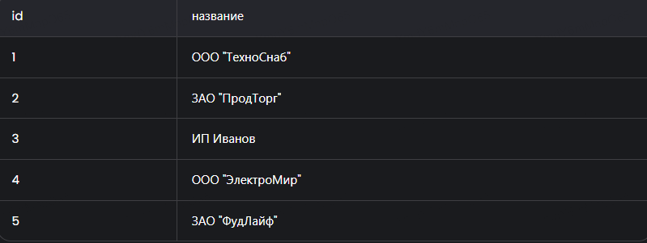
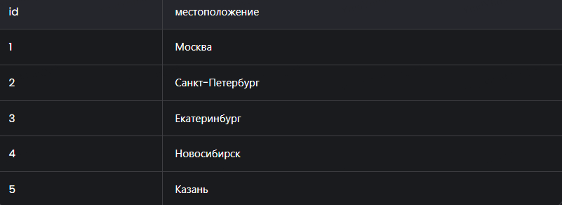
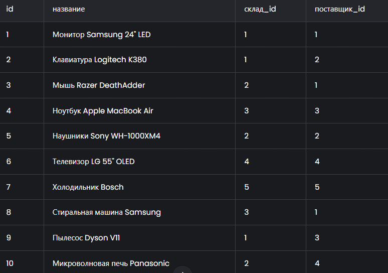

# Лабораторная работа №17
1. Спроектируйте БД с использованием crow’s foot notation.
2. Напишите модели данных, создайте и заполните БД с помощью SQLAlchemy.
3. Напишите запросы для выборки и анализа данных из БД.
4. Оформите отчёт в README.md. Отчёт должен содержать:
- Условия задач
- Описание проделанной работы
- Скриншоты результатов
- Ссылки на используемые материалы
## Варианты заданий:
9. Склады. На каждом складе может храниться некоторое количество различных товаров, у каждого товара должен быть единственный поставщик.

### Создание моделей данных с использованием SQLAlchemy
``` py
from sqlalchemy import create_engine, Column, Integer, String, ForeignKey
from sqlalchemy.orm import declarative_base, relationship, sessionmaker

Base = declarative_base()

class Поставщик(Base):
    __tablename__ = 'поставщики'
    id = Column(Integer, primary_key=True)
    название = Column(String, nullable=False)
    товары = relationship('Товар', back_populates='поставщик')

    def __repr__(self):
        return f"<Поставщик(id={self.id}, название='{self.название}')>"

class Склад(Base):
    __tablename__ = 'склады'
    id = Column(Integer, primary_key=True)
    местоположение = Column(String, nullable=False)
    товары = relationship('Товар', back_populates='склад')

    def __repr__(self):
        return f"<Склад(id={self.id}, местоположение='{self.местоположение}')>"

class Товар(Base):
    __tablename__ = 'товары'
    id = Column(Integer, primary_key=True)
    название = Column(String, nullable=False)
    склад_id = Column(Integer, ForeignKey('склады.id'), nullable=False)
    поставщик_id = Column(Integer, ForeignKey('поставщики.id'), nullable=False)
    склад = relationship('Склад', back_populates='товары')
    поставщик = relationship('Поставщик', back_populates='товары')

    def __repr__(self):
        return f"<Товар(id={self.id}, название='{self.название}', склад_id={self.склад_id}, поставщик_id={self.поставщик_id})>"

# Создание соединения с базой данных
engine = create_engine('sqlite:///warehouse.db')
Base.metadata.create_all(engine)
Session = sessionmaker(bind=engine)
session = Session()
```
### Заполнение базы данных 
``` py
# Добавление поставщиков
supplier1 = Поставщик(название='ООО "ТехноСнаб"')
supplier2 = Поставщик(название='ЗАО "ПродТорг"')
supplier3 = Поставщик(название='ИП Иванов')
session.add_all([supplier1, supplier2, supplier3])
session.commit()

# Добавление складов
warehouse1 = Склад(местоположение='Москва')
warehouse2 = Склад(местоположение='Санкт-Петербург')
warehouse3 = Склад(местоположение='Екатеринбург')
session.add_all([warehouse1, warehouse2, warehouse3])
session.commit()

# Добавление товаров
product1 = Товар(название='Монитор Samsung 24" LED', склад=warehouse1, поставщик=supplier1)
product2 = Товар(название='Клавиатура Logitech K380', склад=warehouse1, поставщик=supplier2)
product3 = Товар(название='Мышь Razer DeathAdder', склад=warehouse2, поставщик=supplier1)
product4 = Товар(название='Ноутбук Apple MacBook Air', склад=warehouse3, поставщик=supplier3)
product5 = Товар(название='Наушники Sony WH-1000XM4', склад=warehouse2, поставщик=supplier2)
session.add_all([product1, product2, product3, product4, product5])
session.commit()
```
### Примеры запросов для выборки и анализа данных
#### Выборка всех товаров с указанием склада и поставщика
``` py
products = session.query(Товар, Склад, Поставщик).join(Склад).join(Поставщик).all()
for товар, склад, поставщик in products:
    print(f"Товар: {товар.название}, Склад: {склад.местоположение}, Поставщик: {поставщик.название}")
```
#### на складе в Москве
``` py
moscow_products = session.query(Товар).join(Склад).filter(Склад.местоположение == 'Москва').all()
for товар in moscow_products:
    print(f"Товар: {товар.название}, Поставщик: {товар.поставщик.название}")
```
#### Анализ количества товаров на каждом складе
``` py
from sqlalchemy import func

warehouse_counts = session.query(Склад.местоположение, func.count(Товар.id)).join(Товар).group_by(Склад.местоположение).all()
for местоположение, count in warehouse_counts:
    print(f"Склад: {местоположение}, Количество товаров: {count}")
```
#### Анализ количества товаров от каждого поставщика
``` py
supplier_counts = session.query(Поставщик.название, func.count(Товар.id)).join(Товар).group_by(Поставщик.название).all()
for название, count in supplier_counts:
    print(f"Поставщик: {название}, Количество товаров: {count}")
```
## поставщики

## склады

## товары

