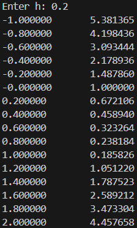
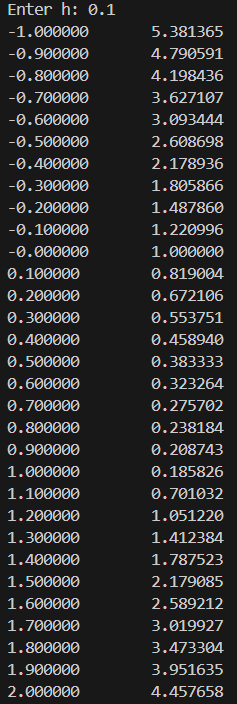
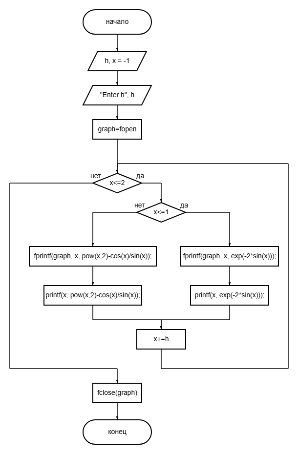
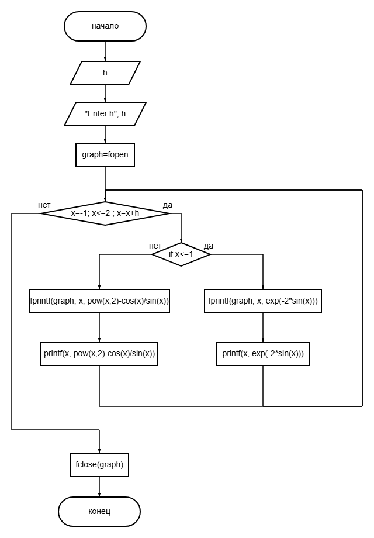
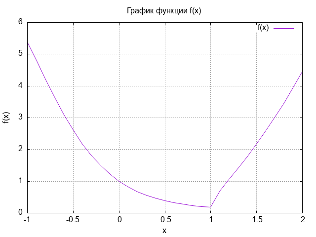

# Лабораторная работа №2
# Вариант 7
## Задание
1. Написать программу собственного варианта, используя оператор цикла while или do while.
2. Написать программу, используя оператор цикла for.
3. Построить график с использованием gnuplot.
4. Составить блок-схемы.
5. Оформить отчёт в README.md.
   $$
f(x) =
  \begin{cases}
    e^{-2sin x} \text{,}       & -1 \leq x \leq 1 \text{;} \\
    x^2 - ctg x \text{,} & 1 < x \leq 2 \text{.}
  \end{cases}
$$

## Программа для while
``` c
#include <stdio.h>
#include <math.h>

int main(){
    double h, x=-1;
    FILE *graph;
    printf("Enter h: ");
    scanf("%lf", &h);
    graph = fopen("graph.txt", "w");
    while (x<=2){
        if (x<=1){
            fprintf(graph, "%lf\t%lf\n", x, exp(-2*sin(x)));
            printf("%lf\t%lf\n", x, exp(-2*sin(x)));
        } else{
            fprintf(graph, "%lf\t%lf\n", x, pow(x,2)-cos(x)/sin(x));
            printf("%lf\t%lf\n", x, pow(x,2)-cos(x)/sin(x));
        }
        x+=(h/2);
        x=round(x*1000000)/1000000;
    }
    fclose(graph);
    return 0;
}
```
## Для for 
``` c
#include <stdio.h›
#include <math.h>

int main(){
    double h;
    FILE *graph;
    printf("Enter h: ");
    scanf ("%lf", &h);
    graph = fopen ("graph.txt", "w");
        for (double x=-1; round(x*1000000)/1000000<=2 ; x=x+h) {
        if (x<=1){
            fprintf(graph, "%.6lf\t%.6lf\n", x, exp(-2*sin(x)));
            printf ("%.61f\t%.61f\n", x, exp(-2*sin(x)));
        } else{
            fprintf(graph,"%.6lf\t%.6lf\n", x, pow(x,2) -cos(x)/sin(x));
            printf("%.6lf\t%.6lf\n", x, pow(x,2)-cos(x)/sin(x));
        }
    }
    fclose(graph);
    return 0;
}
```
## результаты в терминале 
### ``while``:

### ``for`` :


## Блок-схемы
### Для ``while``:

### Для цикла ``for``:


## Графики при помощи gnuplot


